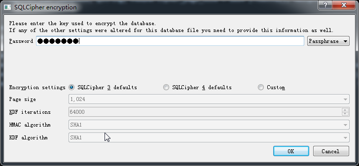
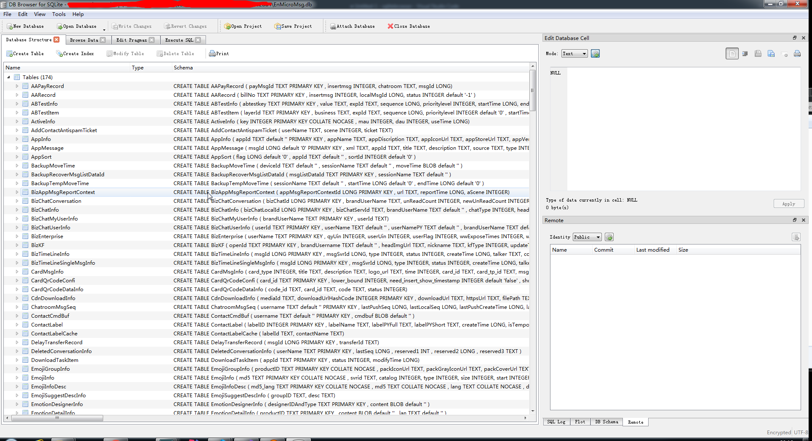
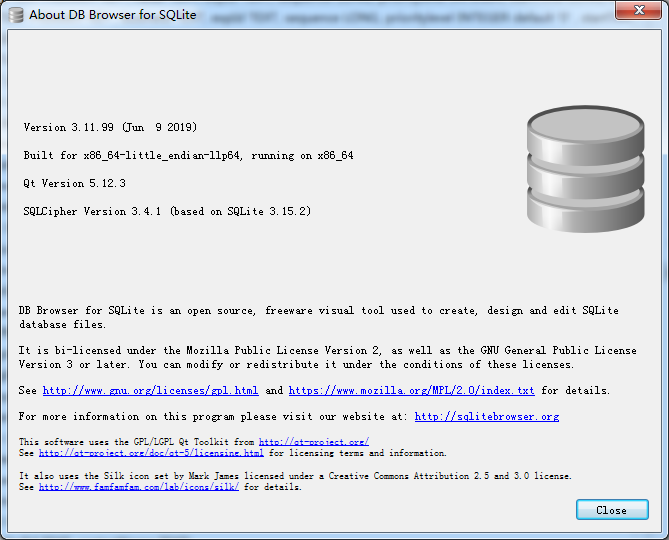

# sqlitebrowser
# 可以打开微信(7.0.4)EnMicroMsg.db的sqlitebrowser

[Download DB Browser for SQLCipher.7z](./Release/DB\ Browser\ for\ SQLCipher.7z)








基于[https://github.com/sqlitebrowser/sqlitebrowser/tree/50c1f46bdbbefaadee01b0674b9cf237eaff5052](https://github.com/sqlitebrowser/sqlitebrowser/tree/50c1f46bdbbefaadee01b0674b9cf237eaff5052)编译。

主要patch代码是PRAGMA参数的顺序。

```
diff --git a/src/sqlitedb.cpp b/src/sqlitedb.cpp                                                                                                                                   
index f7bfc2dd..166206ca 100644                                                                                                                                                    
--- a/src/sqlitedb.cpp                                                                                                                                                             
+++ b/src/sqlitedb.cpp                                                                                                                                                             
@@ -166,11 +166,15 @@ bool DBBrowserDB::open(const QString& db, bool readOnly)                                                                                                     
 #ifdef ENABLE_SQLCIPHER                                                                                                                                                           
     if(isEncrypted && cipherSettings)                                                                                                                                             
     {                                                                                                                                                                             
-        executeSQL(QString("PRAGMA key = %1").arg(cipherSettings->getPassword()), false, false);                                                                                  
-        executeSQL(QString("PRAGMA cipher_page_size = %1;").arg(cipherSettings->getPageSize()), false, false);                                                                    
-        executeSQL(QString("PRAGMA kdf_iter = %1;").arg(cipherSettings->getKdfIterations()), false, false);                                                                       
-        executeSQL(QString("PRAGMA cipher_hmac_algorithm = %1;").arg(cipherSettings->getHmacAlgorithm()), false, false);                                                          
-        executeSQL(QString("PRAGMA cipher_kdf_algorithm = %1;").arg(cipherSettings->getKdfAlgorithm()), false, false);                                                            
+        //executeSQL(QString("PRAGMA key = %1").arg(cipherSettings->getPassword()), false, false);                                                                                
+        //executeSQL(QString("PRAGMA cipher_page_size = %1;").arg(cipherSettings->getPageSize()), false, false);                                                                  
+        //executeSQL(QString("PRAGMA kdf_iter = %1;").arg(cipherSettings->getKdfIterations()), false, false);                                                                     
+        //executeSQL(QString("PRAGMA cipher_hmac_algorithm = %1;").arg(cipherSettings->getHmacAlgorithm()), false, false);                                                        
+        //executeSQL(QString("PRAGMA cipher_kdf_algorithm = %1;").arg(cipherSettings->getKdfAlgorithm()), false, false);                                                          
+               executeSQL(QString("PRAGMA cipher_default_kdf_iter = 4000;"), false, false);                                                                                       
+               executeSQL(QString("PRAGMA key = %1").arg(cipherSettings->getPassword()), false, false);                                                                           
+               executeSQL(QString("PRAGMA cipher_use_hmac = OFF;"), false, false);                                                                                                
+               executeSQL(QString("PRAGMA cipher_page_size = 1024;"), false, false);                                                                                              
     }                                                                                                                                                                             
 #endif                                                                                                                                                                            
     delete cipherSettings;                                                                                                                                                        
@@ -463,19 +467,22 @@ bool DBBrowserDB::tryEncryptionSettings(const QString& filePath, bool* encrypted                                                                             
                 cipherSettings = nullptr;                                                                                                                                         
                 return false;                                                                                                                                                     
             }                                                                                                                                                                     
-                                                                                                                                                                                  
+                                                                                                                                                                                  
+                       sqlite3_exec(dbHandle, QString("PRAGMA cipher_default_kdf_iter = 4000").toUtf8(), nullptr, nullptr, nullptr);                                              
             // Set the key                                                                                                                                                        
             sqlite3_exec(dbHandle, QString("PRAGMA key = %1").arg(cipherSettings->getPassword()).toUtf8(), nullptr, nullptr, nullptr);                                            
+                       sqlite3_exec(dbHandle, QString("PRAGMA cipher_use_hmac = OFF").toUtf8(), nullptr, nullptr, nullptr);                                                       
+                       sqlite3_exec(dbHandle, QString("PRAGMA cipher_page_size = 1024").toUtf8(), nullptr, nullptr, nullptr);                                                     
                                                                                                                                                                                   
             // Set the page size if it differs from the default value                                                                                                             
-            if(cipherSettings->getPageSize() != enc_default_page_size)                                                                                                            
-                sqlite3_exec(dbHandle, QString("PRAGMA cipher_page_size = %1;").arg(cipherSettings->getPageSize()).toUtf8(), nullptr, nullptr, nullptr);                          
-            if(cipherSettings->getKdfIterations() != enc_default_kdf_iter)                                                                                                        
-                sqlite3_exec(dbHandle, QString("PRAGMA kdf_iter = %1;").arg(cipherSettings->getKdfIterations()).toUtf8(), nullptr, nullptr, nullptr);                             
-            if(cipherSettings->getHmacAlgorithm() != enc_default_hmac_algorithm)                                                                                                  
-                sqlite3_exec(dbHandle, QString("PRAGMA cipher_hmac_algorithm = %1;").arg(cipherSettings->getHmacAlgorithm()).toUtf8(), nullptr, nullptr, nullptr);                
-            if(cipherSettings->getKdfAlgorithm() != enc_default_kdf_algorithm)                                                                                                    
-                sqlite3_exec(dbHandle, QString("PRAGMA cipher_kdf_algorithm = %1;").arg(cipherSettings->getKdfAlgorithm()).toUtf8(), nullptr, nullptr, nullptr);                  
+            //if(cipherSettings->getPageSize() != enc_default_page_size)                                                                                                          
+            //    sqlite3_exec(dbHandle, QString("PRAGMA cipher_page_size = %1;").arg(cipherSettings->getPageSize()).toUtf8(), nullptr, nullptr, nullptr);                        
+            //if(cipherSettings->getKdfIterations() != enc_default_kdf_iter)                                                                                                      
+            //    sqlite3_exec(dbHandle, QString("PRAGMA kdf_iter = %1;").arg(cipherSettings->getKdfIterations()).toUtf8(), nullptr, nullptr, nullptr);                           
+            //if(cipherSettings->getHmacAlgorithm() != enc_default_hmac_algorithm)                                                                                                
+            //    sqlite3_exec(dbHandle, QString("PRAGMA cipher_hmac_algorithm = %1;").arg(cipherSettings->getHmacAlgorithm()).toUtf8(), nullptr, nullptr, nullptr);              
+            //if(cipherSettings->getKdfAlgorithm() != enc_default_kdf_algorithm)                                                                                                  
+            //    sqlite3_exec(dbHandle, QString("PRAGMA cipher_kdf_algorithm = %1;").arg(cipherSettings->getKdfAlgorithm()).toUtf8(), nullptr, nullptr, nullptr);                
                                                                                                                                                                                   
             *encrypted = true;                                                                                                                                                    
 #else                                                                                                                                                                             
```